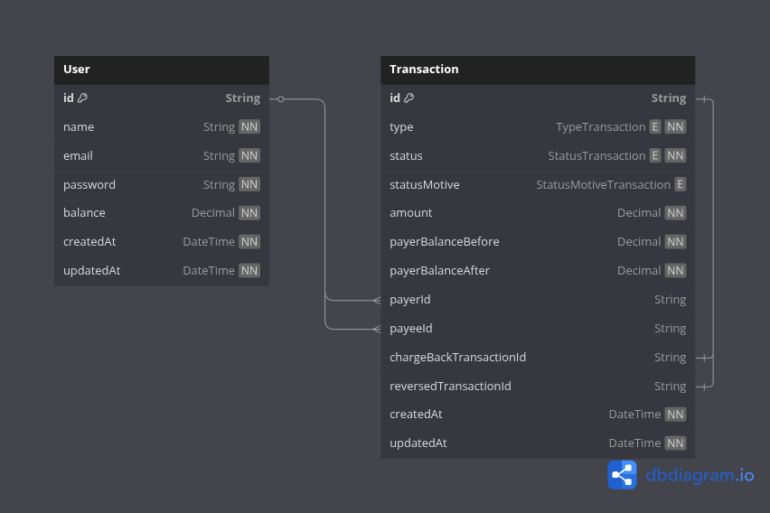
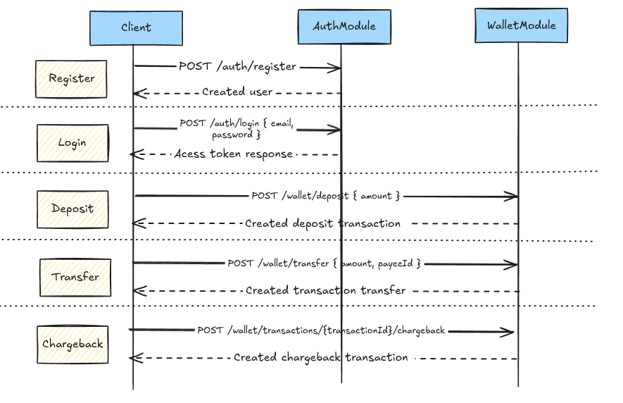

# Desafio Backend Node - Banco

Este projeto foi criado para atender ao desafio técnico proposto no arquivo `desafio backend node BANCO.pdf`. O objetivo principal é implementar um sistema de banco digital com autenticação, operações de depósito, transferência e chargeback.

## Diagramas

### Modelagem do Banco de Dados



### Diagrama de Sequência



## Rotas da API

### Registro de Usuário

`POST /auth/register`

**Exemplo de requisição:**

Content-Type: application/json
```json
{
  "name": "user A",
  "email": "userA@mail.com",
  "password": "UserA!00"
}
```

### Login

`POST /auth/login`

**Exemplo de requisição:**

Content-Type: application/json
```json
{
  "email": "userA@mail.com",
  "password": "UserA!00"
}
```

**Resposta:**
```json
{
  "token": "<jwt_token>"
}
```

### Obter dados do usuário autenticado

`GET /auth/me`

**Headers:**
```
Authorization: Bearer <jwt_token>
```

---

### Depósito

`POST /wallet/deposit`

**Headers:**
```
Authorization: Bearer <jwt_token>
```
**Exemplo de requisição:**
```json
{
  "amount": 100
}
```

### Transferência

`POST /wallet/transfer`

**Headers:**
```
Authorization: Bearer <jwt_token>
```
**Exemplo de requisição:**
```json
{
  "payeeId": "<id_do_destinatario>",
  "amount": 100
}
```

### Chargeback

`POST /wallet/transactions/{transactionId}/chargeback`

**Headers:**
```
Authorization: Bearer <jwt_token>
```

## Testes

- **Testes unitários:**
  ```bash
  yarn test
  ```
- **Testes de integração e2e:**
  ```bash
  yarn test:e2e
  ```